## GENERAL ASSEMBLY Project 2: Eat Natural. A vegan & vegetarian restaurant database.

## [Click here to view Eat Natural](https://maxproject2eatnatural.herokuapp.com/)

### Technology Used During Build
* EJS
* JavaScript
* CSS
* Sketch App
* Git
* Github
* Heroku App

#### Home Page

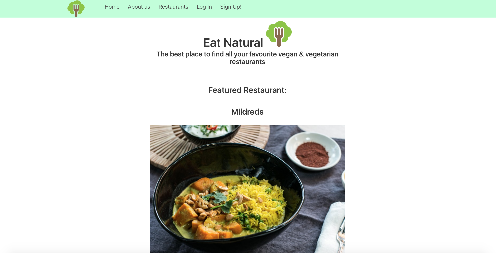
#### Restaurants Index
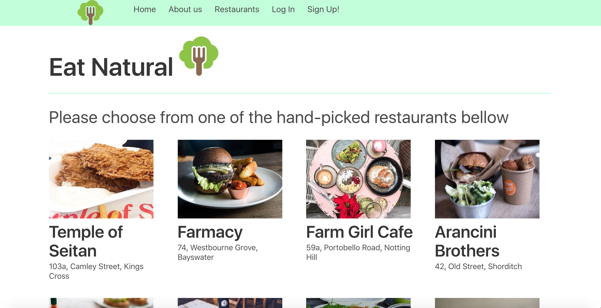
#### Restaurants Show
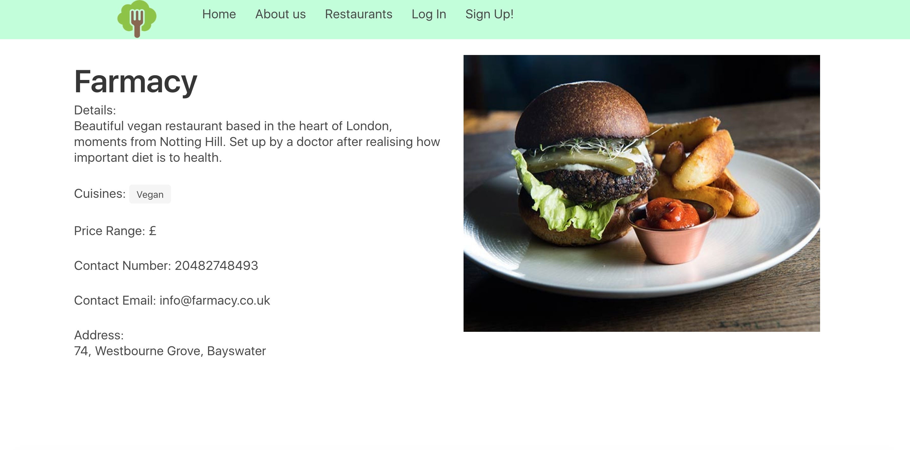
#### Logged In Home
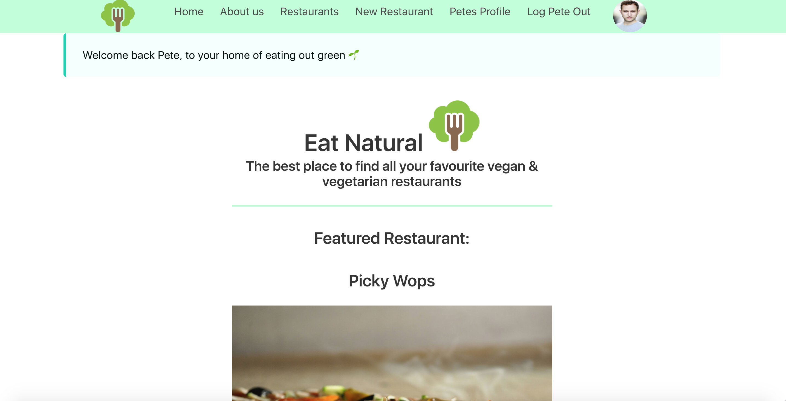
#### User Profile
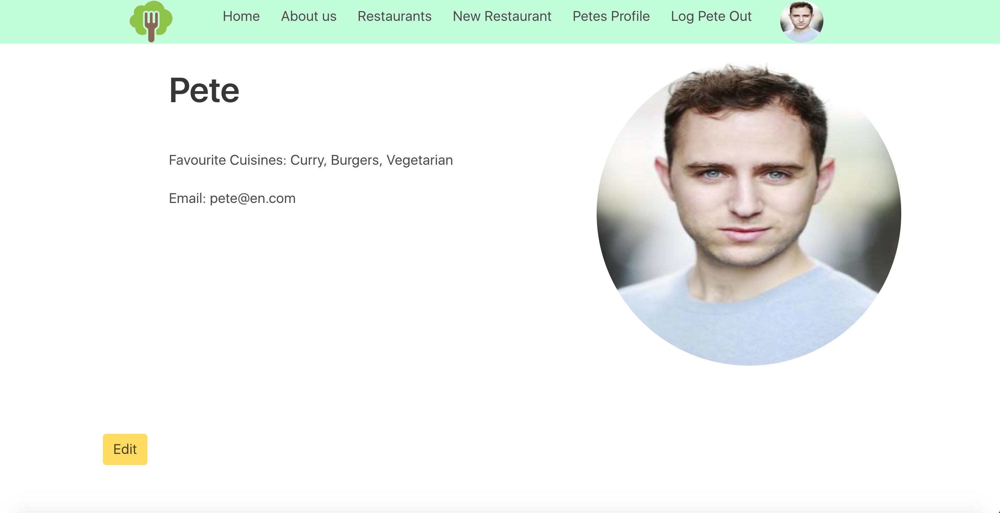
#### Restaurant Show Logged In
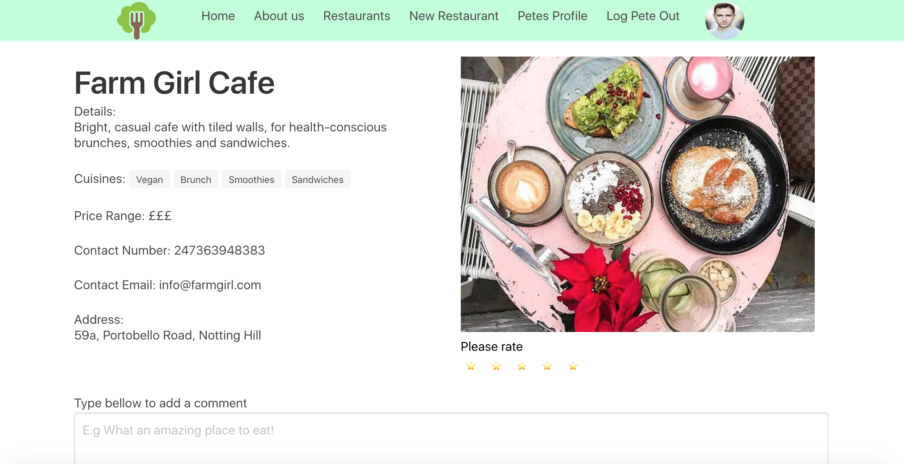
#### Restaurants Home Logged Out
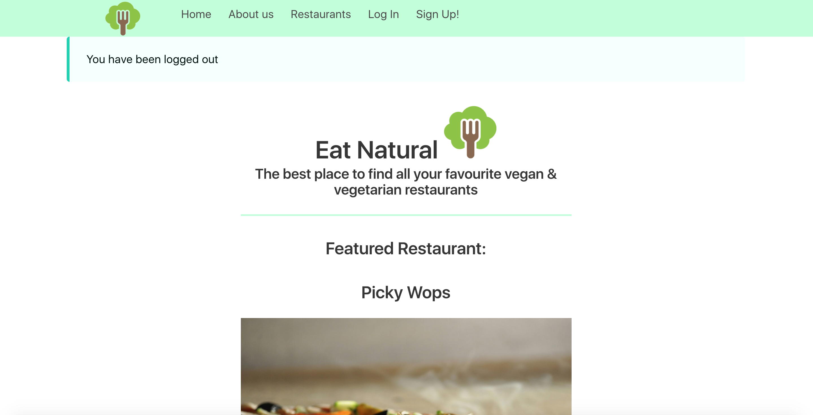

### Process

#### Original Idea / Sketches & Wireframes
- We had been given an option to do a review website for restaurants. This enabled us to reinforce the skills we had been learning the previous week. Before starting the build, I had designed a number of the pages, allowing me to have an end point to work towards.

##### Index

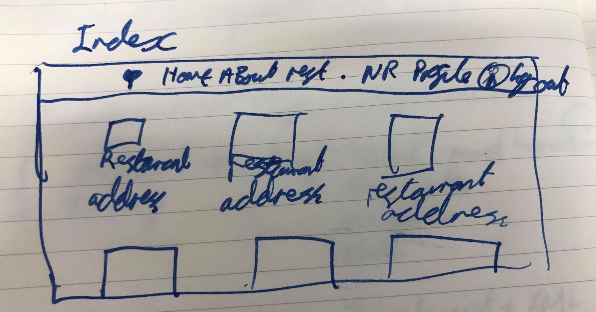
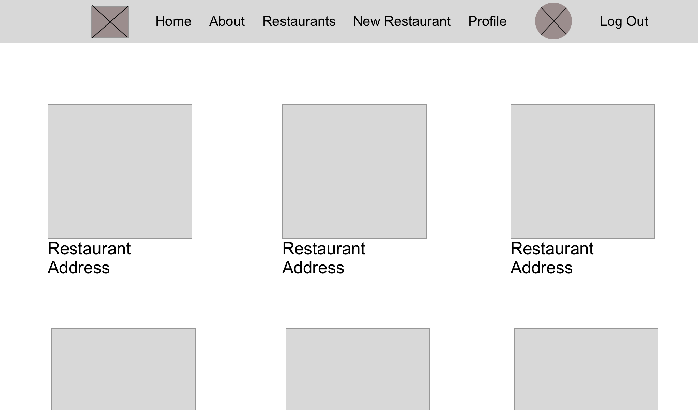

##### Profile

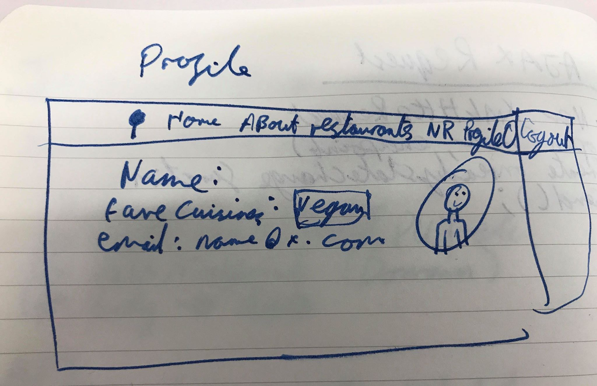
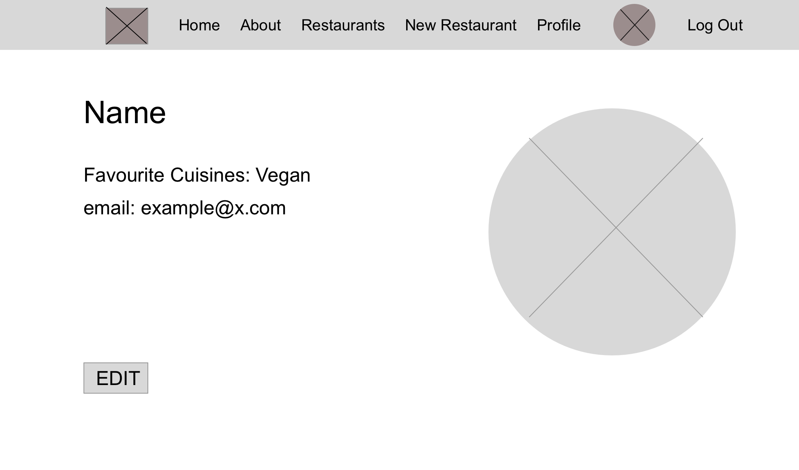

##### Show

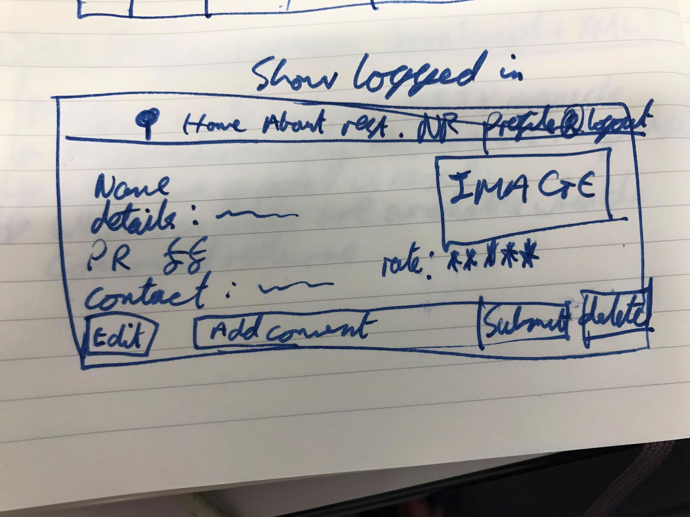
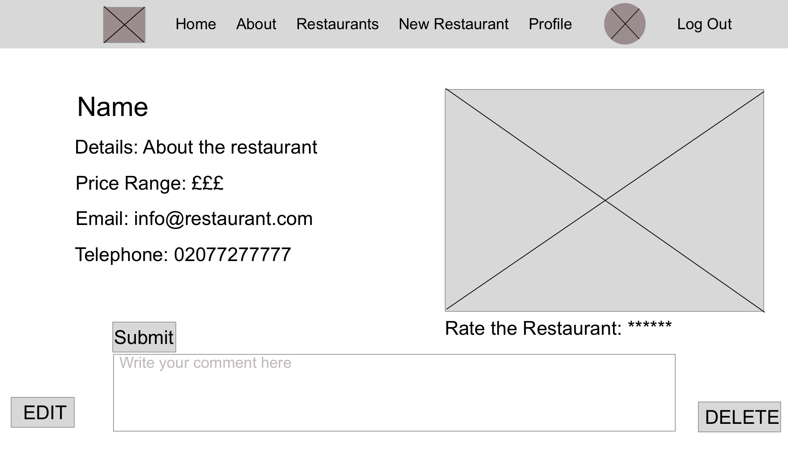

#### Blockers & Bugs
- Having only studied EJS for a week prior to creating this site, it did take a day or two to get use to it. I did find though, with very little information online, it was one of those that was very logical as long as you understood the controllers from the models.

#### Wins
- The biggest win for me was giving users the ability to sign up & create accounts on the website. I had never done anything like this before, so was a huge learning curve.

### Future Features
#### Mobile Responsive
- If more time were available for this project, I would of made the entire website mobile responsive, so users would be able to find the best vegan & vegetarian restaurants while out on the go.

#### Favourite Restaurants
- My next feature to add would have been to add a favourite option to the options. This would allow users once logged in to click a button on the index page on the restaurants they really liked or wanted to save. This list would then be able to appear on their personal profile.
